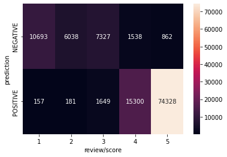

# Úloha​ ​č.​ ​3​ ​-​ ​analýza​ ​sentimentu​ ​recenze

[Hlavní notebook](https://github.com/jankounchained/szn-naborova-uloha/blob/main/uloha.ipynb)

## Metody
- sentiment recenze je reprezentován početem hvězd který zákazník dal produktu
- minimální preprocessing, deduplikace
- binarizace sentimentu na pouze negativní (3 a méně hvězdy) a pozitivní (4 hvězdy a více)
- transfer learning: přeučení modelu distilBERT-base na klasifikaci recenzí
    - hluboká neuronová síť pro zpracování jazyka, předtrénovaná na anglické Wikipdii a knihách v angličtině.
    - distilBERT-base je menší (destilovaná) verze modelu BERT-base, ale stále téměř stejně přesná.
    - Model podobné architektury je [state-of-the-art](https://paperswithcode.com/sota/sentiment-analysis-on-amazon-review-polarity) model na podobném datasetu.

## Výstupy
nový model s ~96% přesností na testovacím datasetu ([k vyzkoušení zde](https://huggingface.co/janko/distilbert-uncased-finefoods))


|          | precision | recall | f1   | accuracy |
|----------|-----------|--------|------|----------|
| NEGATIVE | 0.91      | 0.92   | 0.92 |          |
| POSITIVE | 0.98      | 0.97   | 0.98 |          |
| total    |           |        |      | 0.96     |

<br>

Predikce se zřetelně mění mezi 3. a 4. hvězdou, v souladu s tím, jak byly kategorie definovány.
Model největší jistotu v extrémech (1 nebo 5 hvězd).  
Nejméně jisté jsou predikce 3-hvězdičkových recenzí.



<br>

#### příklady rozhodování modelu
(inicializace)
```
>>> from transformers import AutoTokenizer, AutoModelForSequenceClassification, pipeline
>>> tokenizer = AutoTokenizer.from_pretrained("janko/distilbert-uncased-finefoods")
>>> model = AutoModelForSequenceClassification.from_pretrained("janko/distilbert-uncased-finefoods", from_tf=True)
>>> classifier = pipeline(task="text-classification", model=model, tokenizer=tokenizer)
```


**A) Negace**  
Vypadá to, že ji model zvládá.

```{python}
>>>> classifier('I would recommend this product')
[{'label': 'POSITIVE', 'score': 0.9779092073440552}]

>>>> classifier('I would not recommend this product')
[{'label': 'NEGATIVE', 'score': 0.9986770749092102}]
```

**B) Sarkasmus**  
Nezvládá.
```{python}
>>>> classifier('What a "great" product...')
[{'label': 'POSITIVE', 'score': 0.9972133040428162}]

>>>> classifier('What a great product!!!')
[{'label': 'NEGATIVE', 'score': 0.9995976090431213}]
```

**C) Předpojatost**  
Model nemá rád výrobky z Číny.
```{python}
>>>> classifier('This product was made in the USA')
[{'label': 'POSITIVE', 'score': 0.7475714087486267}]

>>>> classifier('This product was made in China')
[{'label': 'NEGATIVE', 'score': 0.9829034209251404}]
```

## Použití
1. clone `git clone https://github.com/jankounchained/szn-naborova-uloha.git`
2. create a virtual environment `cd szn-naborova-uloha && python3 -m venv ENV_NAME`
3. activate your venv `source ENV_NAME/bin/activate`
4. install requirements `pip install -r requirements.txt`
    - these include TensorFlow, which may require special setup
5. create data folder `mkdir dat/`
6. download data `bash download_data.sh`
7. run `uloha.ipynb` for analysis or `src/finetune_distilbert.py` for fine-tuning
